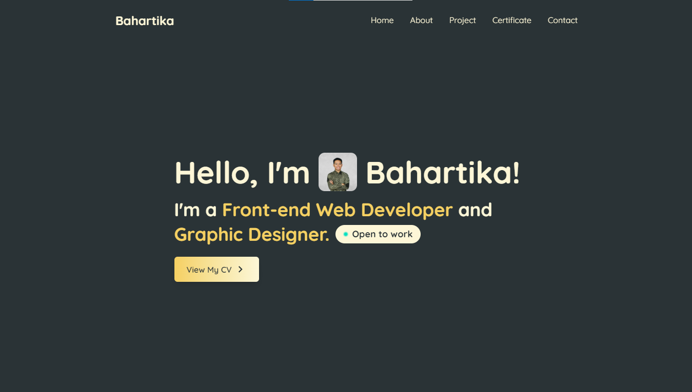

# 🌐 portfolio-v1

Hi there! 👋  
This is my personal portfolio website built with **ReactJS** and **Tailwind CSS**. It includes my intro, about me, project showcase, contact section, and a custom cursor effect to make it a bit more fun ✨

## 🔥 Features

- Responsive landing page
- "About Me" section
- Projects showcase
- Contact form
- Custom gradient cursor effect
- Clean, smooth scroll navigation

## 🚀 Tech Stack

- [ReactJS](https://reactjs.org/)
- [Tailwind CSS](https://tailwindcss.com/)
- [React Scroll](https://www.npmjs.com/package/react-scroll)
- [AOS - Animate on Scroll](https://michalsnik.github.io/aos/)

## 📬 Contact

Feel free to reach out if you’d like to connect or collaborate:

- Email: bahartikasatriawijaya@gmail.com
- instagram: instagram.com/bahartikaa
- LinkedIn: bahartika satria wijaya
